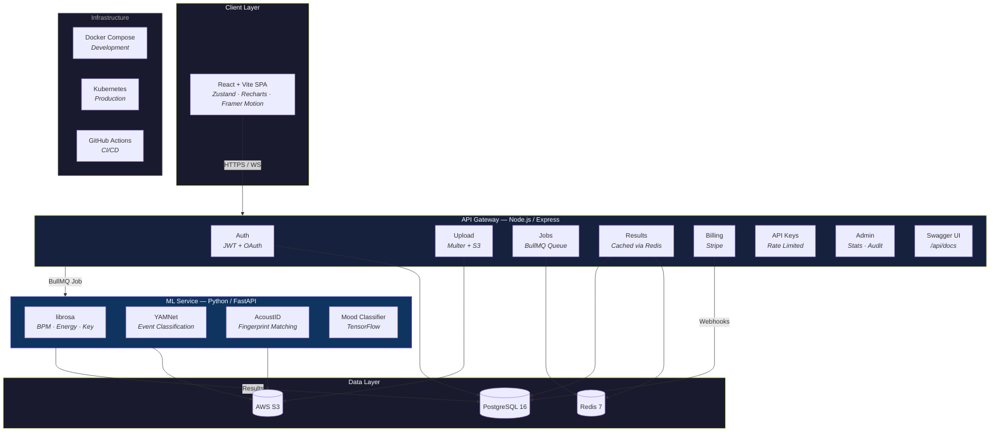

<p align="center">
  
</p>

<h1 align="center">Beatzy — Music Intelligence Engine</h1>

<p align="center">
  <strong>A production-grade, Shazam-inspired platform for song identification, deep AI audio analysis, and SaaS API access.</strong>
</p>

<p align="center">
  
  
  
  
  
  
</p>

<p align="center">
  <a href="https://beatzy-zeta.vercel.app"></a>
</p>

---

## 🌐 Live Deployment

| Service | URL |
|---------|-----|
| **Frontend** | [beatzy-zeta.vercel.app](https://beatzy-zeta.vercel.app) |
| **Backend API** | [beatzy-tvrl.onrender.com](https://beatzy-tvrl.onrender.com) |
| **ML Service** | [aayush-27-beatzy-ml.hf.space](https://aayush-27-beatzy-ml.hf.space) |
| **API Docs** | [beatzy-tvrl.onrender.com/api/docs](https://beatzy-tvrl.onrender.com/api/docs) |

> **Note:** The platform now features a high-performance **Audio Control Center** with real-time spectral decoding, chord synchronization, and beat-reactive visuals.

---

## ✨ Advanced Features

| Category | Capability |
|----------|-----------|
| 🎵 **Real-time Identification** | Fingerprinting with AcoustID + iTunes fallback and debounced song suggestions |
| 🧠 **Neural Control Center** | Playback engine with live chord tracking, spectral stability metering, and neural phase sync |
| 🔊 **Hybrid ML Analysis** | Tempo, mood (XGBoost), energy, and YAMNet neural event classification (527 labels) |
| 📊 **Pro Dashboard** | Recharts analytics, spectral DNA mapping, and interactive force-directed artist echoes |
| 🛡️ **Admin Terminal** | Telemetry overview, user directory, and automated audit security logs |
| 🔑 **SaaS API** | Tiered API key system with rate limiting per plan and automated documentation |
| 💳 **Stripe Billing** | Full subscription lifecycle with checkout, webhooks, and customer portal |
| 🔐 **Enterprise Auth** | JWT + refresh token rotation + Google OAuth 2.0 integration |
| ⚡ **Real-time Engine** | Socket.IO for live spectral upload progress and job orchestration |

---

## 🏗️ Architecture



---

## 🛠️ Tech Stack

| Layer | Technology |
|-------|-----------|
| **Frontend** | React 18, Vite, Zustand, TailwindCSS, Recharts, Framer Motion, Socket.IO Client |
| **Backend** | Node.js 20, Express, BullMQ, Socket.IO, Swagger UI |
| **ML Service** | Python 3.11, FastAPI, librosa, TensorFlow (YAMNet), Scikit-learn |
| **Database** | PostgreSQL 16 |
| **Cache / Queue** | Redis 7 |
| **Storage** | AWS S3 / MinIO |
| **Auth** | JWT (access + refresh rotation) + Google OAuth 2.0 |
| **Payments** | Stripe (Checkout, Webhooks, Billing Portal) |
| **Deployment** | Docker Compose (dev) · Kubernetes + Kustomize (prod) |

---

## 🚀 Getting Started

### Prerequisites

- **Docker & Docker Compose** (recommended)
- Node.js 20+ and Python 3.11+ (for manual setup)

### Quick Start (Docker)

```bash
# 1. Clone
git clone https://github.com/aayush2724/Beatzy.git
cd Beatzy

# 2. Configure environment
cp backend/.env.example backend/.env
cp ml-service/.env.example ml-service/.env
cp frontend/.env.example frontend/.env
# Edit the .env files with your API keys (AcoustID, Spotify, Stripe, AWS, etc.)

# 3. Launch all services
docker-compose up --build
```

| Service | URL |
|---------|-----|
| Frontend | http://localhost:5173 |
| Backend API | http://localhost:3000 |
| API Docs (Swagger) | http://localhost:3000/api/docs |
| ML Service | http://localhost:8000 |
| ML Docs (FastAPI) | http://localhost:8000/docs |

---

## ☸️ Kubernetes Deployment

Production manifests are in the `k8s/` directory with Kustomize support.

```bash
# Apply all manifests
kubectl apply -k k8s/
```

---

## 📄 License

This project is licensed under the [MIT License](LICENSE).

---

<p align="center">
  Built with ❤️ by <a href="https://github.com/aayush2724">Aayush</a>
</p>
