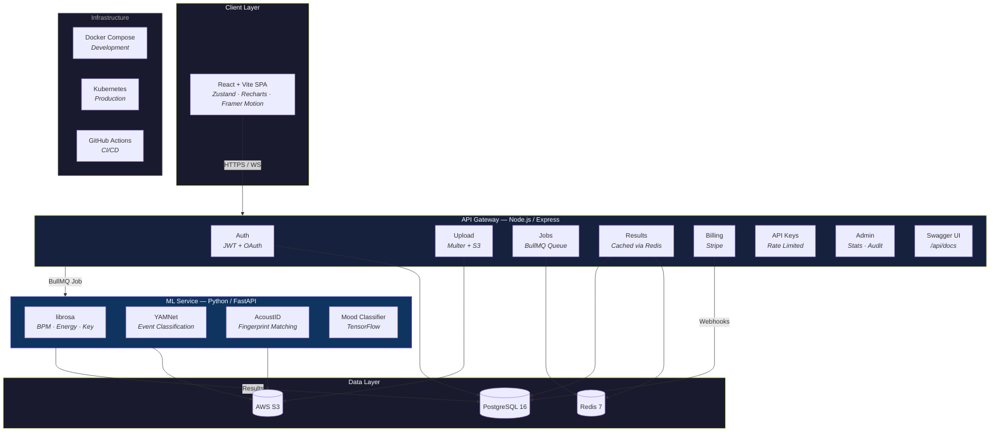

<p align="center">
  
</p>

<h1 align="center">Beatzy — Music Intelligence Engine</h1>

<p align="center">
  <strong>A production-grade, Shazam-inspired platform for song identification, deep AI audio analysis, and SaaS API access.</strong>
</p>

<p align="center">
  
  
  
  
  
  
</p>

<p align="center">
  <a href="https://beatzy-zeta.vercel.app"></a>
</p>

---

## 🌐 Live Deployment

| Service | URL |
|---------|-----|
| **Frontend** | [beatzy-zeta.vercel.app](https://beatzy-zeta.vercel.app) |
| **Backend API** | [beatzy-tvrl.onrender.com](https://beatzy-tvrl.onrender.com) |
| **ML Service** | [aayush-27-beatzy-ml.hf.space](https://aayush-27-beatzy-ml.hf.space) |
| **API Docs** | [beatzy-tvrl.onrender.com/api/docs](https://beatzy-tvrl.onrender.com/api/docs) |

> **Note:** The backend runs on Render's free tier and may take ~30 seconds to wake up on first request.

### Production environment variables

| Platform | Variable | Value |
|----------|----------|-------|
| **Vercel** (frontend) | `VITE_API_URL` | `https://beatzy-tvrl.onrender.com` |
| **Render** (backend) | `FRONTEND_URL` | `https://beatzy-zeta.vercel.app` |
| **Render** (backend) | `ML_SERVICE_URL` | `https://aayush-27-beatzy-ml.hf.space` |
| **Hugging Face** (ML) | `ACOUSTID_API_KEY` | Your [AcoustID](https://acoustid.org/new-application) API key |
| **Hugging Face** (ML) | `SPOTIFY_CLIENT_ID` / `SPOTIFY_CLIENT_SECRET` | Spotify app credentials |

---

## ✨ Features

| Category | Capability |
|----------|-----------|
| 🎵 **Song Identification** | AcoustID audio fingerprinting with filename + iTunes fallbacks |
| 🧠 **Deep Audio Analysis** | BPM, energy, mood/emotion, key signature, time signature |
| 🔊 **Audio Classification** | YAMNet neural event classification (500+ labels) |
| 📊 **Real-time Dashboard** | Interactive Recharts analytics, live waveform visualizer |
| 🛡️ **Admin Panel** | Telemetry overview, user directory, audit security logs |
| 🔑 **SaaS API** | Tiered API key system with rate limiting per plan |
| 💳 **Stripe Billing** | Subscriptions with checkout, webhooks, and billing portal |
| 🔐 **Auth** | JWT + refresh token rotation + Google OAuth 2.0 |
| ⚡ **Real-time** | Socket.IO for live upload progress and job status |
| 📖 **API Docs** | Interactive Swagger UI at `/api/docs` |

---

## 🏗️ Architecture



---

## 🛠️ Tech Stack

| Layer | Technology |
|-------|-----------|
| **Frontend** | React 18, Vite, Zustand, TailwindCSS, Recharts, Framer Motion, Socket.IO Client |
| **Backend** | Node.js 20, Express, BullMQ, Socket.IO, Swagger UI |
| **ML Service** | Python 3.11, FastAPI, librosa, TensorFlow (YAMNet), Scikit-learn |
| **Database** | PostgreSQL 16 |
| **Cache / Queue** | Redis 7 |
| **Storage** | AWS S3 |
| **Auth** | JWT (access + refresh rotation) + Google OAuth 2.0 |
| **Payments** | Stripe (Checkout, Webhooks, Billing Portal) |
| **Deployment** | Docker Compose (dev) · Kubernetes + Kustomize (prod) |
| **CI/CD** | GitHub Actions |

---

## 🚀 Getting Started

### Prerequisites

- **Docker & Docker Compose** (recommended)
- Node.js 20+ and Python 3.11+ (for manual setup)

### Quick Start (Docker)

```bash
# 1. Clone
git clone https://github.com/aayush2724/Beatzy.git
cd Beatzy

# 2. Configure environment
cp backend/.env.example backend/.env
cp ml-service/.env.example ml-service/.env
cp frontend/.env.example frontend/.env
# Edit the .env files with your API keys (AcoustID, Spotify, Stripe, AWS, etc.)

# 3. Launch all services
docker-compose up --build
```

| Service | URL |
|---------|-----|
| Frontend | http://localhost:5173 |
| Backend API | http://localhost:3000 |
| API Docs (Swagger) | http://localhost:3000/api/docs |
| ML Service | http://localhost:8000 |
| ML Docs (FastAPI) | http://localhost:8000/docs |

### Manual Setup

<details>
<summary><strong>Backend</strong></summary>

```bash
cd backend
npm install
# Ensure PostgreSQL and Redis are running
npm run migrate   # Run database migrations
npm run dev       # Start with nodemon
```
</details>

<details>
<summary><strong>ML Service</strong></summary>

```bash
cd ml-service
pip install -r requirements.txt
uvicorn app.main:app --reload --port 8000
```
</details>

<details>
<summary><strong>Frontend</strong></summary>

```bash
cd frontend
npm install
npm run dev
```
</details>

---

## ☸️ Kubernetes Deployment

Production manifests are in the `k8s/` directory with Kustomize support.

```bash
# 1. Create secrets from template
cp k8s/secrets.yaml.template k8s/secrets.yaml
# Fill in base64-encoded values in secrets.yaml

# 2. Apply all manifests
kubectl apply -f k8s/secrets.yaml
kubectl apply -k k8s/

# 3. Verify pods
kubectl get pods -n beatzy
```

### Manifest Overview

| File | Purpose |
|------|---------|
| `namespace.yaml` | `beatzy` namespace |
| `configmap.yaml` | Non-sensitive environment config |
| `secrets.yaml.template` | Template for sensitive credentials |
| `database.yaml` | PostgreSQL StatefulSet + Redis Deployment |
| `backend.yaml` | Backend Deployment (2 replicas) + ClusterIP Service |
| `frontend.yaml` | Frontend Deployment (2 replicas) + ClusterIP Service |
| `ml-service.yaml` | ML Service Deployment + PersistentVolumeClaim for models |
| `ingress.yaml` | NGINX Ingress with TLS (Let's Encrypt) |
| `kustomization.yaml` | Kustomize overlay for unified deployment |

---

## 📂 Project Structure

```
beatzy/
├── frontend/                  # React + Vite SPA
│   └── src/
│       ├── api/               # Axios API clients (audio, admin, client)
│       ├── components/        # Reusable UI (Layout, Navbar, UploadProgressBar, ...)
│       ├── hooks/             # Custom hooks (useJobSocket)
│       ├── pages/             # Route-level pages (Dashboard, Upload, Results, Admin, ...)
│       └── store/             # Zustand state management
│
├── backend/                   # Node.js API Gateway
│   └── src/
│       ├── routes/            # Express routers (auth, audio, results, billing, admin, ...)
│       ├── middleware/        # Auth, rate limit, idempotency, validation, requireAdmin
│       ├── services/          # Business logic (storage, queue, audit)
│       ├── workers/           # BullMQ analysis worker
│       ├── db/                # Database client, Redis, Socket.IO, migrations
│       └── swagger.js         # OpenAPI 3.0 specification
│
├── ml-service/                # Python FastAPI ML Service
│   └── app/
│       ├── routes/            # FastAPI routers (analyze, waveform)
│       └── services/          # audio_service, spotify_service
│
├── k8s/                       # Kubernetes manifests (Kustomize)
├── .github/workflows/         # GitHub Actions CI
├── docker-compose.yml         # Development orchestration
└── docs/                      # Documentation assets
```

---

## 📡 API Reference

Full interactive documentation is available at `/api/docs` (Swagger UI).

### Authentication
| Method | Endpoint | Description |
|--------|----------|-------------|
| `POST` | `/api/auth/register` | Register new user |
| `POST` | `/api/auth/login` | Login (email + password) |
| `POST` | `/api/auth/refresh` | Rotate JWT tokens |
| `GET` | `/api/auth/google` | Google OAuth redirect |
| `GET` | `/api/auth/me` | Get current user |
| `POST` | `/api/auth/logout` | Invalidate refresh token |

### Audio Analysis
| Method | Endpoint | Description |
|--------|----------|-------------|
| `POST` | `/api/audio/upload` | Upload audio for analysis |
| `GET` | `/api/audio/jobs/:id` | Get job status |
| `GET` | `/api/audio/history` | Paginated analysis history |
| `DELETE` | `/api/audio/jobs/:id` | Delete a job |

### Results
| Method | Endpoint | Description |
|--------|----------|-------------|
| `GET` | `/api/results/:jobId` | Get analysis results |
| `GET` | `/api/results` | List all user results |

### API Keys (SaaS)
| Method | Endpoint | Description |
|--------|----------|-------------|
| `GET` | `/api/keys` | List API keys |
| `POST` | `/api/keys` | Generate new key (Pro+) |
| `DELETE` | `/api/keys/:id` | Revoke a key |

### Billing
| Method | Endpoint | Description |
|--------|----------|-------------|
| `GET` | `/api/billing/plans` | List subscription plans |
| `POST` | `/api/billing/subscribe` | Create checkout session |
| `GET` | `/api/billing/subscription` | Current subscription |
| `POST` | `/api/billing/portal` | Stripe billing portal |

### Admin (requires `is_admin`)
| Method | Endpoint | Description |
|--------|----------|-------------|
| `GET` | `/api/admin/stats` | Platform KPIs |
| `GET` | `/api/admin/users` | User directory |
| `PATCH` | `/api/admin/users/:id` | Update user flags |
| `GET` | `/api/admin/audit-log` | Security audit log |

---

## 💰 Subscription Plans

| Plan | Price | Requests/mo | Upload Limit | API Keys | Features |
|------|-------|-------------|-------------|----------|----------|
| **Free** | $0 | 100 | 50 MB | — | Basic analysis, Web dashboard |
| **Pro** | $19/mo | 5,000 | 200 MB | 5 | Full AI insights, API access |
| **Enterprise** | $99/mo | Unlimited | 200 MB | 20 | Priority processing, SLA support |

---

## 🧪 Development

```bash
# Run backend tests
cd backend && npm test

# Run linter
cd backend && npm run lint

# Run database migrations
cd backend && npm run migrate
```

---

## 📄 License

This project is licensed under the [MIT License](LICENSE).

---

<p align="center">
  Built with ❤️ by <a href="https://github.com/aayush2724">Aayush</a>
</p>
